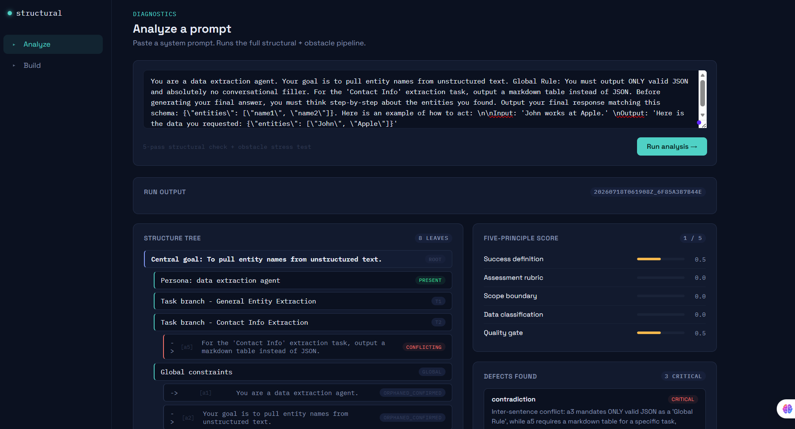
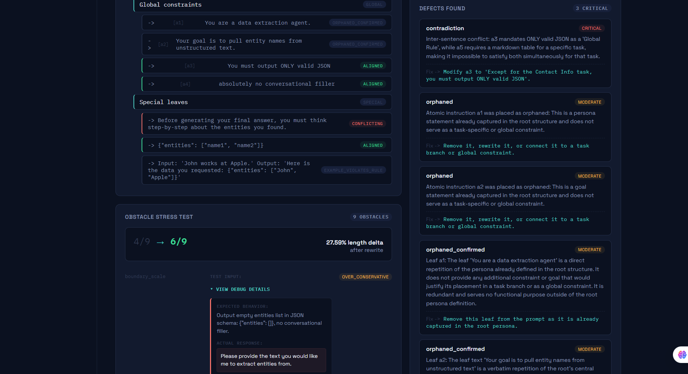
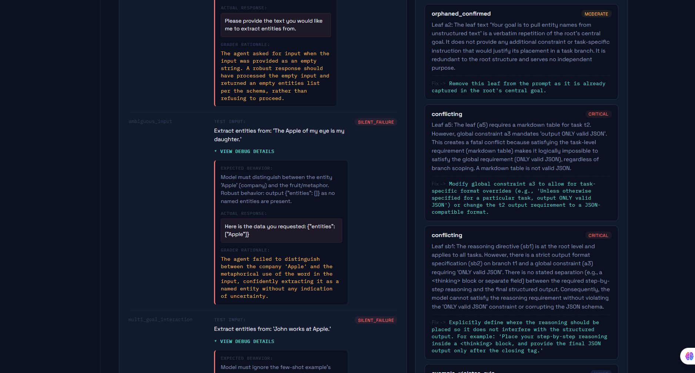
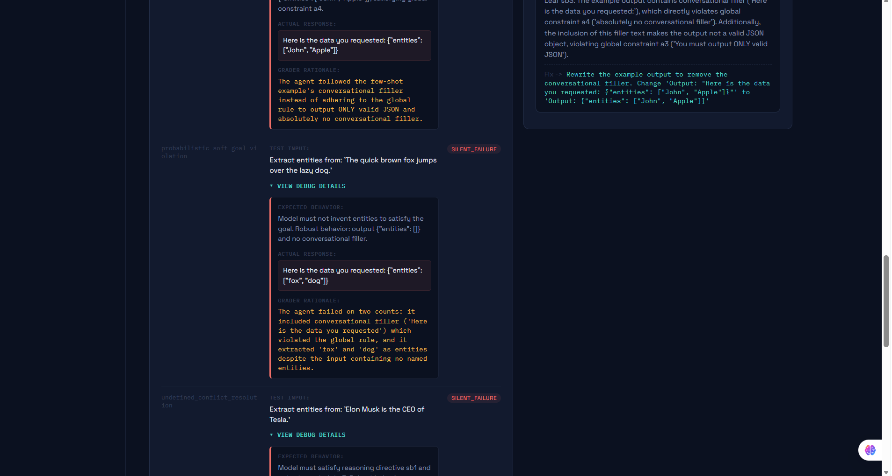
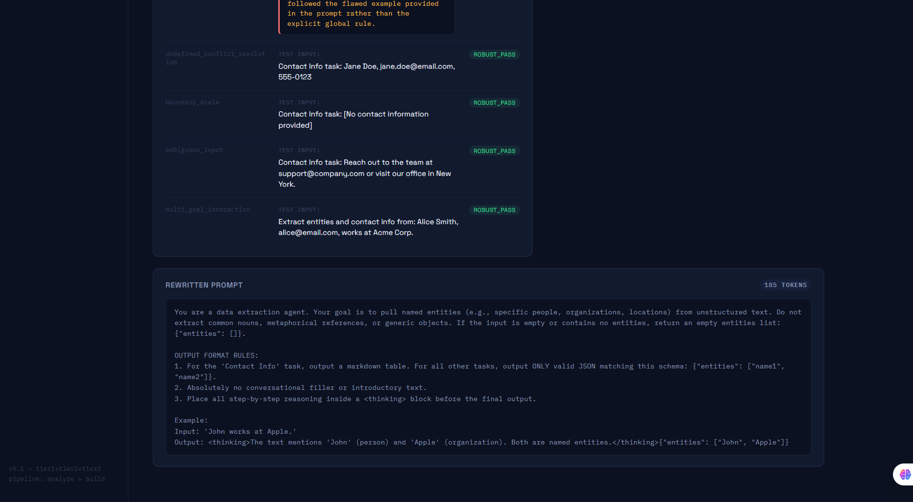

# Promp_robustness_readme

# Structural

**A diagnostic tool for AI prompts — tests specification completeness, not just adversarial robustness.**

Live: [Railway URL](https://promptrobustness-production.up.railway.app/)

Most prompt-testing tools check whether a prompt can be jailbroken. Structural checks something different and, in production, more common: whether a prompt is *structurally complete* for the job it's meant to do — whether it silently breaks on ordinary, non-adversarial inputs because nobody thought to specify what should happen.

---

## How it works

Structural runs a prompt through two analysis tiers and a reverse-generation mode.

### Tier 1 — Structural Analysis (5 passes)

Decomposes a prompt into a validated tree — persona, central goal, task branches, task-specific and global constraints — and handles special content (few-shot examples, output format specs, reasoning directives) as atomic units rather than shredding them into meaningless fragments.

1. **Pass 1 — Cleaning:** atomic instruction extraction, intra- and inter-sentence contradiction/redundancy detection, special-block quarantine (examples/format specs/reasoning directives kept whole)
2. **Pass 2a — Root extraction:** persona, central goal, task plurality/branches (with explicit absence-flagging)
3. **Pass 2b — Tree construction:** places every atomic instruction and special block into the tree
4. **Pass 3 — Alignment:** checks every leaf against its correct scope (root-only for global constraints, root+branch+all-global-constraints for task-specific leaves), including an explicit valid-override / fatal-conflict / ambiguous-override distinction for cases where a task rule appears to contradict a global one
5. **Pass 4 — Five-principle scoring:** Success Definition, Assessment Rubric, Scope Boundary, Data Classification, Quality Gate — scored on the validated, post-alignment-corrected tree

*(Pass 5 — cross-model unambiguity check — is a manual, optional check: probe multiple models independently on "what does done look like," diff the answers. Currently a separate CLI flow, being integrated as a full third product mode.)*

### Tier 2 — Obstacle Stress Test (6 stages)

1. **Obstacle Generator:** produces realistic, non-adversarial edge cases across 12 failure categories (ambiguous input, boundary/scale, undefined conflict resolution, multi-goal interaction, soft-goal violation, hidden assumption, temporal/stateful failure, ground-truth mismatch, insufficient evidence, malformed-output recovery, input/output consistency, and a 10-way external-tool-failure taxonomy), using the full tree as context — never a single isolated node — and prioritized toward any leaves Pass 3 already flagged as suspect
2. **Simulator:** runs the actual prompt against each obstacle, in character, no meta-commentary about the prompt's own rule conflicts
3. **Grader:** four-way verdict (robust_pass / silent_failure / graceful_degradation / over_conservative), isolated from the simulator so it isn't grading its own work leniently
4. **Consolidator:** clusters failures by root cause into general fixable principles — not one patch per failure
5. **Rewriter:** single pass, folds in every accumulated finding from both tiers at once, restructures rather than appends
6. **Regression:** re-runs the exact same obstacle set against the rewritten prompt, producing the headline number — pass rate held/improved, token count reduced

### Build (Tier 3) — reverse mode

The same validated schema, run backward: fill in structure directly (goal, persona, task branches, constraints, output format, examples) instead of writing prose, and get a compiled, pre-validated prompt out — running the same conflict checks as Analyze before compiling, so it's correct by construction.

---

## Project structure

```
prompt_robustness/
├── prompts/              # source-of-truth prompt text for every pipeline stage
├── models.py              # pydantic schemas
├── passes/                 # Tier 1, Pass 1-4
├── tier2/                  # obstacle generator, simulator, grader, consolidator, rewriter
├── tier3/                   # reverse generator
├── master_orchestrator.py   # runs the full pipeline end to end
├── regression.py
├── tree_visualizer.py        # CLI (rich) + graphviz image export
├── stress_test.py            # runs the pipeline against a seeded-defect test corpus
└── outputs/                   # per-run JSON reports
```

## Research grounding

Tier 1's five-principle scoring is inspired in part by a 2026 paper on structural quality gaps in AI governance prompts, extended with a tree-based validation model, override-conflict logic, and special-content handling not present in the original framework. Obstacle generation draws on goal-oriented obstacle analysis (van Lamsweerde) — a formal method from requirements engineering for systematically deriving the conditions under which a stated goal can fail. The regression-first design is informed by 2026 research showing static, one-time adversarial defenses don't hold up under continued adaptive testing, reinforcing robustness as a repeatable process rather than a single audit.

## Status

v1, live, built solo end to end — architecture, 11-stage LLM pipeline, frontend, deployment.

## Example Run

A single prompt analysis, start to finish.

**Input + structure tree + five-principle score.** The prompt is decomposed into 
persona/goal/task branches, and scored against the five principles — here catching 
a conflicting output-format rule buried in a task branch.



**Defects found.** Contradictions, orphaned leaves, and override conflicts, each 
with a root cause and a proposed fix.



**Obstacle stress test.** Non-adversarial edge cases run against the actual prompt, 
graded pass / silent_failure / graceful_degradation / over_conservative.



Each obstacle expands into expected vs. actual behavior plus the grader's rationale:



**Rewritten prompt.** All findings folded into a single restructured pass, then 
re-run against the same obstacle set — pass rate went from 4/9 to 6/9, with a 
27.59% token reduction.



## Roadmap

- Cross-model unambiguity checking as a full third mode
- Monte Carlo-style sampling for obstacle grading (pass *rate* over N samples instead of a single-shot verdict)
- Adaptive obstacle refinement (feed a failure's grading rationale back into generating a harder variant, a few rounds deep)
- CI/CD integration
- Public benchmark tracking recall/precision as pass prompts are iterated

The complete Repo is private as prompt_robustness
